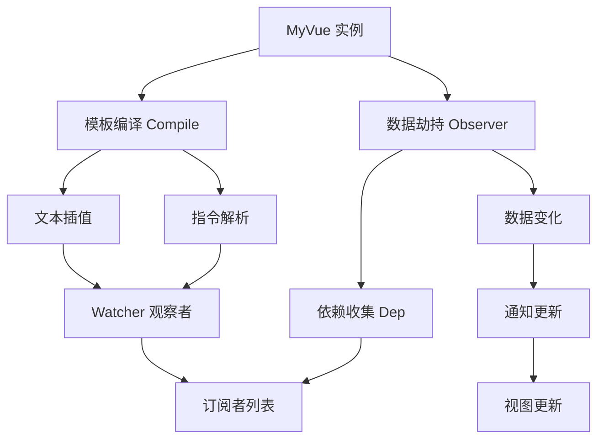

# 🚀 MyVue - 自定义 Vue.js 实现

<div align="center">


**一个从零开始实现的简化版 Vue.js 框架**

[📖 项目介绍](#-项目介绍) • [🏗️ 架构设计](#️-架构设计) • [📁 文件结构](#-文件结构) • [🚀 快速开始](#-快速开始) • [💡 核心特性](#-核心特性)

</div>

---

## 📖 项目介绍

这是一个**教学性质**的 Vue.js 简化实现，展示了现代前端框架的核心原理。通过手写代码，深入理解 Vue.js 的响应式系统、模板编译和依赖收集机制。

### 🎯 学习目标
- 🔍 理解 Vue.js 的响应式原理
- 🧠 掌握依赖收集和派发更新机制  
- 📝 学习模板编译和虚拟 DOM 概念
- ⚡ 体验数据驱动的开发模式

---

## 🏗️ 架构设计

### 📊 核心架构图



### 🔄 响应式流程

1. **📥 初始化阶段**
   - 创建 MyVue 实例
   - 数据劫持 (Observer)
   - 模板编译 (Compile)

2. **🔗 依赖收集阶段**
   - 解析模板中的 `{{}}` 插值
   - 解析 `v-model` 指令
   - 创建 Watcher 观察者

3. **⚡ 更新阶段**
   - 数据变化触发 setter
   - 通知所有相关 Watcher
   - 更新对应的 DOM 节点

---

## 📁 文件结构

```
my_vue/
├── 📄 package.json          # 项目配置
├── 📄 Readme.md             # 项目文档
├── 📄 test.js               # 测试文件
└── 📁 src/                  # 源代码目录
    ├── 🌐 index.html        # 入口页面
    ├── 🏗️ Myvue.js          # 主框架类
    ├── 👁️ Obsever.js        # 数据劫持
    ├── 🔧 Compile.js         # 模板编译
    ├── 👂 Watcher.js        # 观察者
    ├── 📦 Dep.js            # 依赖收集
    └── 🛠️ CompileUtil.js    # 编译工具
```

### 📋 核心文件说明

| 文件 | 图标 | 功能描述 |
|------|------|----------|
| `Myvue.js` | 🏗️ | 主框架类，Vue 实例的入口点 |
| `Obsever.js` | 👁️ | 数据劫持，使用 Object.defineProperty 监听数据变化 |
| `Compile.js` | 🔧 | 模板编译，解析 `{{}}` 插值和 `v-model` 指令 |
| `Watcher.js` | 👂 | 观察者模式，连接数据和视图 |
| `Dep.js` | 📦 | 依赖收集器，管理所有 Watcher |
| `CompileUtil.js` | 🛠️ | 编译工具函数，提供数据获取方法 |

---

## 🚀 快速开始

### 📋 环境要求
- 🌐 现代浏览器 (支持 ES6+)
- 📝 文本编辑器

### 🛠️ 安装步骤

1. **📥 克隆项目**
   ```bash
   git clone <repository-url>
   cd my_vue
   ```

2. **🌐 打开浏览器**
   ```bash
   # 直接打开 index.html 文件
   open src/index.html
   ```

3. **🎉 开始体验**
   - 在输入框中输入内容
   - 观察数据绑定效果
   - 查看浏览器控制台的调试信息

### 💻 使用示例

```javascript
// 创建 Vue 实例
const mv = new MyVue({
    el: '#app',           // 🎯 挂载元素
    data: {               // 📊 响应式数据
        msg: 'hello',     // 💬 消息
        info: 'world'     // ℹ️ 信息
    }
})
```

```html
<!-- 模板示例 -->
<div id="app">
    <input type="text" v-model="msg">    <!-- 🔗 双向绑定 -->
    <div>{{msg}}---{{info}}</div>        <!-- 📝 文本插值 -->
</div>
```

---

## 💡 核心特性

### ✨ 已实现功能

| 特性 | 图标 | 状态 | 描述 |
|------|------|------|------|
| 数据劫持 | 👁️ | ✅ | 使用 Object.defineProperty 监听数据变化 |
| 模板编译 | 🔧 | ✅ | 解析 `{{}}` 插值语法 |
| 指令支持 | 🎯 | ✅ | 支持 `v-model` 双向绑定 |
| 依赖收集 | 📦 | ✅ | 自动收集和更新依赖关系 |
| 观察者模式 | 👂 | ✅ | Watcher 模式实现数据驱动 |

### 🚧 待实现功能

| 特性 | 图标 | 优先级 | 描述 |
|------|------|--------|------|
| 事件处理 | 🎪 | 🔥 高 | 支持 `@click` 等事件指令 |
| 条件渲染 | 🔀 | 🔥 高 | 支持 `v-if`、`v-show` 指令 |
| 列表渲染 | 📋 | 🔥 高 | 支持 `v-for` 循环指令 |
| 计算属性 | 🧮 | 🟡 中 | 实现 computed 计算属性 |
| 组件系统 | 🧩 | 🟡 中 | 支持组件化开发 |
| 虚拟 DOM | 🌳 | 🟢 低 | 实现虚拟 DOM 和 diff 算法 |

---

## 🔍 技术原理

### 📊 响应式原理

```javascript
// 数据劫持示例
Object.defineProperty(data, key, {
    get() {
        // 🔍 收集依赖
        Dep.target && dep.addSub(Dep.target)
        return val
    },
    set(newVal) {
        // ⚡ 触发更新
        val = newVal
        dep.notify()
    }
})
```

### 🎯 模板编译流程

1. **📝 解析阶段**: 遍历 DOM 节点，识别指令和插值
2. **🔗 绑定阶段**: 创建 Watcher 连接数据和视图
3. **⚡ 更新阶段**: 数据变化时自动更新对应 DOM

### 👂 观察者模式

```javascript
// Watcher 观察者
class Watcher {
    constructor(vm, key, cb) {
        this.vm = vm
        this.cb = cb
        this.oldVal = this.getOldVal(key, vm)
    }
    
    update() {
        this.cb()  // 🔄 执行更新回调
    }
}
```

---

## 🎓 学习价值

### 🧠 核心概念理解
- **响应式系统**: 理解数据变化如何自动更新视图
- **依赖收集**: 掌握如何建立数据和视图的依赖关系
- **模板编译**: 学习如何将模板转换为可执行的代码
- **观察者模式**: 理解设计模式在前端框架中的应用

### 📚 进阶学习路径
1. **🔍 深入源码**: 研究 Vue.js 官方源码实现
2. **⚡ 性能优化**: 学习虚拟 DOM 和 diff 算法
3. **🧩 组件化**: 理解组件通信和生命周期
4. **🌐 生态学习**: 学习 Vue Router、Vuex 等生态工具

---

## 🤝 贡献指南

欢迎提交 Issue 和 Pull Request 来改进这个项目！

### 📝 贡献方式
- 🐛 报告 Bug
- 💡 提出新功能建议
- 📖 完善文档
- 🧪 添加测试用例

---

## 📄 许可证

本项目采用 [ISC](https://opensource.org/licenses/ISC) 许可证。

---

<div align="center">

**🌟 如果这个项目对你有帮助，请给个 Star 支持一下！**

Made with ❤️ by [Your Name]

</div>